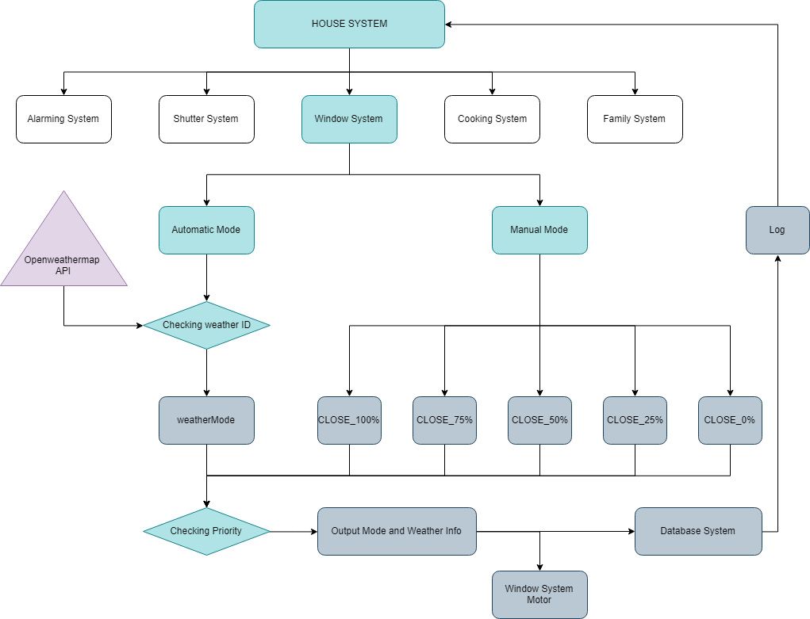
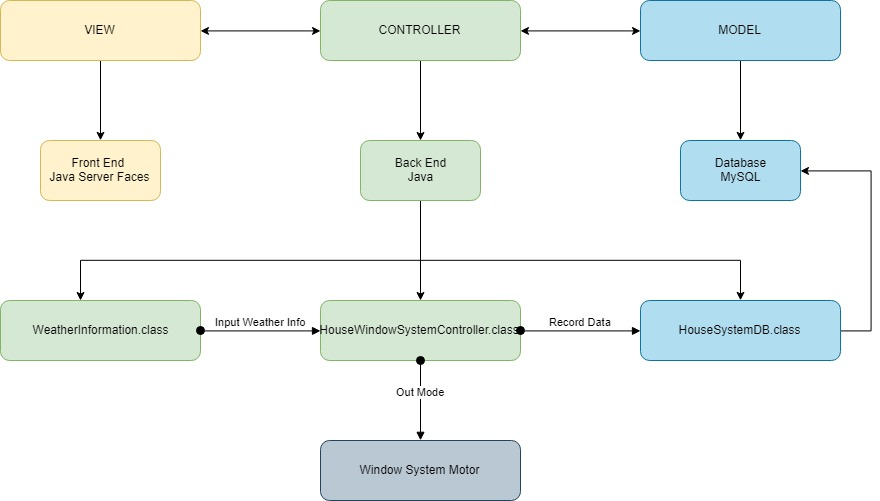

# House Window System

Application of House Window System about changing Window System Mode automatically by using openweathermap API

### System Diagram

### Class Diagram

### Screen Shot

###
Running Application by running index.xhtml instead of java class. Taking care of inputing your own MySQL account!(or it might not work:))
